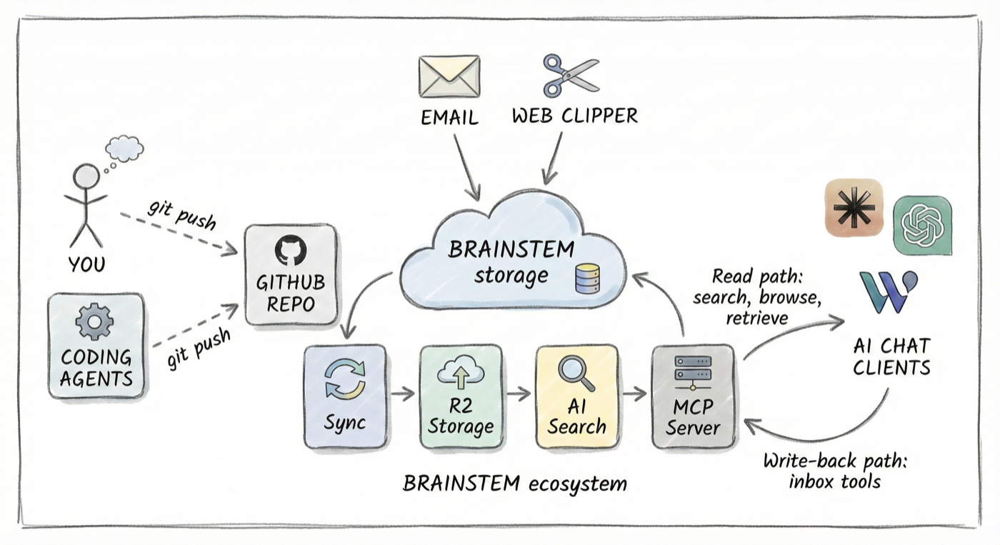

<p align="center">
  
</p>

<h1 align="center">Brainstem</h1>

<p align="center"><strong>Give your AI a second brain.</strong></p>

---

You maintain a personal knowledge base — notes, docs, references — in a GitHub repo. Maybe you use Obsidian, Logseq, or just plain markdown. Maybe you use Claude Code, ClawdBot, Codex, or another agent to help maintain it.

**Brainstem** connects that repo to your AI chat clients so you can search and retrieve your own knowledge from anywhere — your phone, your desktop, or any MCP-compatible tool.

Here's how it works:

1. **You have a GitHub-hosted PKM** (personal knowledge management) repo, public or private
2. **You install the Brainstem GitHub App** on that repo
3. **Brainstem embeds your content** and keeps its index up-to-date with every push
4. **Brainstem exposes search & retrieval tools via MCP** that you connect to any compatible AI client (Claude Mobile, Claude Desktop, Claude Code, etc.)

That's it. Push to GitHub, and your AI can search it within a minute.

<p align="center">
  
</p>

## Quick Start

### 1. Connect Your Repository

1. Visit [brainstem.cc/setup](https://brainstem.cc/setup)
2. Click **Connect Repository** to install the GitHub App
3. Select your repository
4. Copy your unique MCP endpoint URL from the success page

### 2. Connect Your AI Client

#### Claude.ai (Web) — easiest

1. Go to **Settings → Connectors → Add custom connector**
2. Paste your MCP endpoint URL: `https://brainstem.cc/mcp/{your-uuid}`
3. Claude.ai handles authentication automatically via OAuth — no token needed

#### Claude Desktop / Claude Code

Add to your MCP config (Claude Desktop: `claude_desktop_config.json`, Claude Code: `.mcp.json` or via `claude mcp add`):

```json
{
  "mcpServers": {
    "my-brain": {
      "url": "https://brainstem.cc/mcp/{your-uuid}"
    }
  }
}
```

OAuth authentication is handled automatically — you'll be prompted to authorize with GitHub on first use. No manual token needed.

## MCP Tools

Brainstem exposes six tools over MCP:

| Tool | Description |
|------|-------------|
| `search_brain` | Semantic search across your knowledge base. Results include source links back to GitHub. The tool description dynamically reflects your actual content domains and topics. |
| `get_document` | Retrieve the full contents of a file by its path. |
| `list_recent` | List recently modified files, optionally filtered by path prefix. |
| `list_folders` | Browse the folder structure of your repo. |
| `brain_inbox` | Compose a note for your inbox. In Claude Desktop, opens an interactive composer with live markdown preview, 5-second auto-save countdown, and edit/cancel controls. Notes are saved to both GitHub and the search index. |
| `about` | Information about your Brainstem instance and available content. |

## How Sync Works

```
GitHub Push → Webhook → Brainstem Worker → R2 Storage → AI Search (reindex)
```

- When you push to your connected repo, GitHub sends a webhook to Brainstem
- Brainstem fetches the changed files via the GitHub API and stores them in Cloudflare R2
- A reindex is triggered on Cloudflare AI Search
- New content is searchable within ~1 minute

Sync is incremental — only changed files are fetched on each push.

## Architecture

Built on Cloudflare's stack:

- **Cloudflare Workers** with Durable Objects for MCP session state
- **Cloudflare R2** for file storage
- **Cloudflare D1** (SQLite) for installation and user tracking
- **Cloudflare AI Search** for semantic search and retrieval
- **GitHub App** for authentication, webhooks, and repo access

## Security & Privacy

Your synced files are stored on Cloudflare R2, encrypted at rest with AES-256-GCM (Cloudflare-managed keys), and indexed by Cloudflare AI Search for semantic retrieval. All connections use TLS. Access to your data requires authentication via GitHub OAuth.

The platform operator has technical access to stored content for operational purposes. This is the same trust model as most SaaS products — you are trusting both the infrastructure provider (Cloudflare) and the platform operator. Do not connect repositories containing secrets, credentials, or highly sensitive data you are not comfortable storing on a third-party service.

You can disconnect and delete all your synced data at any time by uninstalling the GitHub App from your repository settings. Uninstallation triggers automatic cleanup of all stored files and search index entries.

For a full analysis of the encryption and isolation model, see [ADR-003: Encryption at Rest](docs/adr/003-encryption-at-rest.md).

## Documentation

- [TROUBLESHOOTING.md](./TROUBLESHOOTING.md) — Common issues and solutions
- [CLAUDE.md](./CLAUDE.md) — Implementation details and development guide

## License

ISC
