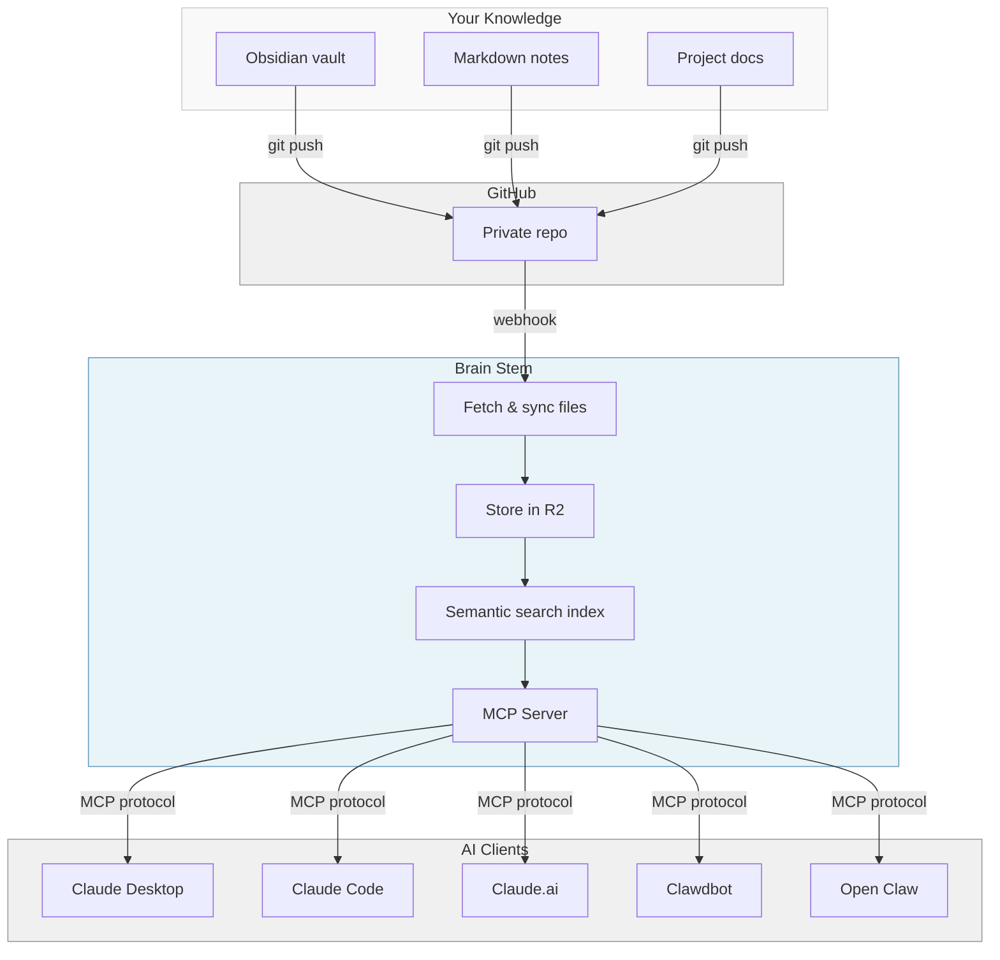

# Brain Stem Site Content

This file is the source of truth for all page content on brainstem.cc.
When you update this file, ask Claude to regenerate the HTML templates.

---

## Homepage (`/`)

### Hero

# Brain Stem

Give your AI a second brain.

### Introduction

Brain Stem connects your personal knowledge base on GitHub to AI chat clients like Claude Mobile, giving your AI fast, simple access to your notes and context. Currently supports `.md`, `.txt`, `.json`, `.yaml`, and `.yml` files.

### How It Works

**1. You maintain a "second brain"**

Notes, docs, or a knowledge base in a private GitHub repo. Maybe you use Obsidian, Notion exports, or just markdown files.

**2. Connect it to Brain Stem**

Install our GitHub App on your repo. We sync your files and make them searchable with semantic search.

**3. Your AI can access it**

Claude Desktop, Claude Code, or any MCP-compatible client can search and retrieve from your brain in seconds.

### Flow Diagram



### Tools

Brain Stem exposes six tools over MCP. Your AI client discovers them automatically when connected.

**search_brain** — Semantic search across your knowledge base. Returns relevant passages with source document links. The tool description dynamically reflects your actual content domains and topics so your AI knows what to search for.

**get_document** — Retrieve the full contents of a file by its path. Use after a search to read a full document, or when you know the exact file you want.

**list_recent** — List recently modified files, optionally filtered by a path prefix. Useful for seeing what's changed or finding recent notes.

**list_folders** — Browse the folder structure of your repo. Helps your AI understand how your knowledge base is organized.

**brain_inbox** — Add a note to the brain's inbox. Creates a timestamped `.md` file in the `inbox/` folder of your GitHub repo. The folder is created automatically on first use — no setup required. Notes are committed directly to GitHub (so they appear in your repo) and also written to the search index. Use this to capture thoughts, reminders, or context from any AI conversation. Parameters: `title` (string) — short title for the note, used as filename (e.g. "grocery-list"); `content` (string) — the markdown content of the note.

**about** — Returns information about your Brain Stem instance, including what content is available and how to use the other tools.

### Security & Privacy

Your files are stored on Cloudflare R2, encrypted at rest with AES-256-GCM (Cloudflare-managed keys) and indexed by Cloudflare AI Search for semantic retrieval. The platform operator has technical access to stored content for operational purposes. Do not connect repositories containing secrets, credentials, or data you are not comfortable storing on a third-party service. You can disconnect and delete your data at any time by uninstalling the GitHub App. See [ADR-003](https://github.com/dudgeon/git-brain/blob/main/docs/adr/003-encryption-at-rest.md) for the full security model analysis.

### Footer

Brain Stem is open source. [View on GitHub](https://github.com/dudgeon/git-brain)

### Closing

That's it. No complex setup. No manual file uploads. Push to GitHub, and your AI knows about it within a minute.

### Primary CTA

Connect Repository

### Secondary Links

Already connected? Get your auth token | View setup

---

## Success Page (`/setup/callback`)

### Title

Connected!

### Intro

Your repository **{repo-name}** is now synced and searchable.

### Step 1: Get Your Auth Token

Brain Stem uses GitHub to verify you own your repos. Click below to authenticate and get your bearer token.

**CTA:** Authorize with GitHub

### Step 2: Configure Your AI Client

#### Claude Desktop / Claude Code

Add to your MCP config (on macOS: `~/.config/claude/mcp_servers.json`):

```json
{
  "mcpServers": {
    "my-brain": {
      "url": "https://brainstem.cc/mcp/{uuid}",
      "headers": {
        "Authorization": "Bearer YOUR_TOKEN_HERE"
      }
    }
  }
}
```

Replace `{uuid}` with your installation ID below, and `YOUR_TOKEN_HERE` with your bearer token from step 1.

#### Claude.ai (Web)

Settings → Connectors → Add custom connector → paste your endpoint URL and add the Authorization header.

### Your Installation ID

`{uuid}`

### Your Endpoint

`https://brainstem.cc/mcp/{uuid}`

### Already installed?

Need a new token? You can [re-authorize with GitHub](/oauth/authorize) at any time to get a fresh bearer token.

### Help

Questions? Check the [troubleshooting guide](https://github.com/dudgeon/git-brain/blob/main/TROUBLESHOOTING.md).

---

## OAuth Success Page (`/oauth/callback`)

### Title

Authenticated!

### Intro

Welcome, **{github-login}**.

### Connect to Claude.ai (shown if installation found)

In Claude.ai Settings → Connectors → Add custom connector

**Remote server MCP url:** `{mcp-url}` [Copy]

> OAuth Client ID and Client Secret are not needed — Claude.ai handles authentication automatically.

### No installation warning (shown if no installation found)

> **No installation found.** [Connect a repository](/setup) first, then return here to get your MCP URL.

### Claude Code / Desktop

Add to your MCP config:

**Bearer Token:** `{session-token}` [Copy]

Expires: {expiry-date}

```json
{
  "mcpServers": {
    "my-brain": {
      "url": "https://brainstem.cc/mcp/{uuid}",
      "headers": {
        "Authorization": "Bearer {session-token}"
      }
    }
  }
}
```

> **Copy these values now.** They won't be shown again.

---

## Error: Installation Cancelled (`/setup/callback?error=...`)

### Title

Installation Cancelled

### Message

You cancelled the GitHub App installation. No worries — you can try again whenever you're ready.

**CTA:** Try Again

---

## Error: OAuth Cancelled (`/oauth/callback?error=...`)

### Title

Authorization Cancelled

### Message

You cancelled the GitHub authorization. You'll need to authorize to get a bearer token for your AI client.

**CTA:** Try Again
