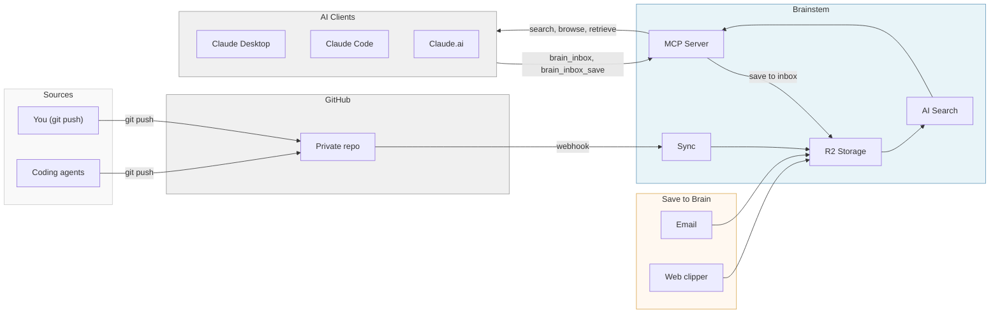

# Brain Stem Site Content

This file is the source of truth for all page content on brainstem.cc.
When you update this file, ask Claude to regenerate the HTML templates.

---

## Homepage (`/`)

### Hero

# Brain Stem

Give your AI a second brain.

### Introduction

Brain Stem connects your personal knowledge base on GitHub to AI chat clients like Claude Mobile, giving your AI fast, simple access to your notes and context. Currently supports `.md`, `.txt`, `.json`, `.yaml`, and `.yml` files.

### How It Works

**1. You maintain a "second brain"**

Notes, docs, or a knowledge base in a private GitHub repo. Maybe you use Obsidian, Notion exports, or just markdown files.

**2. Connect it to Brain Stem**

Install our GitHub App on your repo. We sync your files and make them searchable with semantic search.

**3. Your AI can access it**

Claude Desktop, Claude Code, or any MCP-compatible client can search and retrieve from your brain in seconds.

### Flow Diagram



### Tools

Brain Stem exposes eight tools over MCP. Your AI client discovers them automatically when connected.

**search_brain** — Semantic search across your knowledge base. Returns relevant passages with source document links. The tool description dynamically reflects your actual content domains and topics so your AI knows what to search for.

**get_document** — Retrieve the full contents of a file by its path. Use after a search to read a full document, or when you know the exact file you want.

**list_recent** — List recently modified files, optionally filtered by a path prefix. Useful for seeing what's changed or finding recent notes.

**list_folders** — Browse the folder structure of your repo. Helps your AI understand how your knowledge base is organized.

**brain_inbox** — Add a note to the brain's inbox. In Claude Desktop, this opens an interactive composer with a live markdown preview, a 5-second countdown before auto-save, and the ability to edit or cancel before the note is committed. Notes are saved to both your GitHub repo and the search index. In other clients, the note content is returned as text.

**brain_inbox_save** — Save a note directly to the brain inbox (R2 + GitHub). Preferred for non-UI hosts and AI agents. In Claude Desktop, the interactive `brain_inbox` composer calls this automatically after the countdown.

**brain_account** — Manage email-to-brain forwarding. Set up a brainstem email address, verify sender addresses, and claim a vanity alias (e.g., `dan@brainstem.cc`). Once configured, forwarded emails are saved as inbox notes.

**about** — Returns information about your Brain Stem instance, including what content is available and how to use the other tools.

### Ways to Save

Beyond syncing your GitHub repo, there are three additional ways to add content to your brain:

**Email forwarding** — Forward any email to your brainstem address and it's saved as an inbox note. Set up via the `brain_account` tool in any connected AI client.

**Web clipper** — A browser bookmarklet that extracts and saves articles with one click. Available on your OAuth success page and at `/bookmarklet`.

**Inbox tools** — Ask your AI to save notes, reminders, or thoughts directly via `brain_inbox` (interactive composer in Claude Desktop) or `brain_inbox_save` (direct save).

All saved content lands in your `inbox/` folder, syncs to GitHub, and is searchable within a minute.

### Security & Privacy

Your files are stored on Cloudflare R2, encrypted at rest with AES-256-GCM (Cloudflare-managed keys) and indexed by Cloudflare AI Search for semantic retrieval. The platform operator has technical access to stored content for operational purposes. Do not connect repositories containing secrets, credentials, or data you are not comfortable storing on a third-party service. You can disconnect and delete your data at any time by uninstalling the GitHub App. See [ADR-003](https://github.com/dudgeon/git-brain/blob/main/docs/adr/003-encryption-at-rest.md) for the full security model analysis. If you'd prefer to be your own operator, you can [self-host your own instance](https://github.com/dudgeon/git-brain/blob/main/docs/SELF-HOSTING.md).

### Footer

Brain Stem is open source. [View on GitHub](https://github.com/dudgeon/git-brain) · [Privacy Policy](/privacy)

### Closing

That's it. No complex setup. Push to GitHub, forward an email, clip a webpage, or ask your AI to take a note -- it's all searchable within a minute.

### Primary CTA

Connect Repository

### Secondary Links

Already connected? Get your auth token | View setup

---

## Success Page (`/setup/callback`)

### Title

Connected!

### Intro

Your repository **{repo-name}** is now synced and searchable.

### Step 1: Get Your Auth Token

Brain Stem uses GitHub to verify you own your repos. Click below to authenticate and get your bearer token.

**CTA:** Authorize with GitHub

### Step 2: Configure Your AI Client

#### Claude Desktop / Claude Code

Add to your MCP config (on macOS: `~/.config/claude/mcp_servers.json`):

```json
{
  "mcpServers": {
    "my-brain": {
      "url": "https://brainstem.cc/mcp/{uuid}",
      "headers": {
        "Authorization": "Bearer YOUR_TOKEN_HERE"
      }
    }
  }
}
```

Replace `{uuid}` with your installation ID below, and `YOUR_TOKEN_HERE` with your bearer token from step 1.

#### Claude.ai (Web)

Settings → Connectors → Add custom connector → paste your endpoint URL and add the Authorization header.

### Your Installation ID

`{uuid}`

### Your Endpoint

`https://brainstem.cc/mcp/{uuid}`

### What else can you do?

Once connected, your AI has access to eight tools: search, document retrieval, folder browsing, note-taking, and email forwarding setup. You can also:

- **Save web pages**: Get the bookmarklet from your [OAuth success page](/oauth/authorize)
- **Forward emails**: Set up email-to-brain in any connected client by asking about `brain_account`

### Already installed?

Need a new token? You can [re-authorize with GitHub](/oauth/authorize) at any time to get a fresh bearer token.

### Help

Questions? Check the [troubleshooting guide](https://github.com/dudgeon/git-brain/blob/main/TROUBLESHOOTING.md).

---

## OAuth Success Page (`/oauth/callback`)

### Title

Authenticated!

### Intro

Welcome, **{github-login}**.

### Connect to Claude.ai (shown if installation found)

In Claude.ai Settings → Connectors → Add custom connector

**Remote server MCP url:** `{mcp-url}` [Copy]

> OAuth Client ID and Client Secret are not needed — Claude.ai handles authentication automatically.

### No installation warning (shown if no installation found)

> **No installation found.** [Connect a repository](/setup) first, then return here to get your MCP URL.

### Claude Code / Desktop

Add to your MCP config:

**Bearer Token:** `{session-token}` [Copy]

Expires: {expiry-date}

```json
{
  "mcpServers": {
    "my-brain": {
      "url": "https://brainstem.cc/mcp/{uuid}",
      "headers": {
        "Authorization": "Bearer {session-token}"
      }
    }
  }
}
```

> Need a new token? You can [re-authorize with GitHub](/oauth/authorize) anytime.

### Web Clipper (shown if installation found)

Save articles from any browser. [Full setup instructions →](/bookmarklet)

Drag this to your bookmarks bar:

**[Save to Brain]** ← draggable bookmarklet link (bearer token embedded)

---

## Bookmarklet Page (`/bookmarklet`)

### Title

Web Clipper

### Intro

Save articles and web pages to your brain inbox from any browser.

### Bookmarklet

Drag this to your bookmarks bar: **[Save to Brain]**

1. Drag the button above to your browser's bookmarks bar
2. Navigate to any article or web page
3. Click "Save to Brain" in your bookmarks bar
4. Optionally add a context note when prompted
5. The article will be extracted and saved to your brain inbox

### iOS Shortcut

Save links from any iOS app via the Share Sheet:

1. Open the Shortcuts app on your iPhone/iPad
2. Create a new shortcut with a Share Sheet trigger (accepts URLs)
3. Add a "Get Name" action (extracts page title)
4. Add an "Ask for Input" action with prompt: "Add a note (optional)"
5. Add a "Get Contents of URL" action (POST to /api/clip with bearer token, JSON body with url, title, context)
6. Add a "Show Notification" action: "Saved to brain!"

---

## Error: Installation Cancelled (`/setup/callback?error=...`)

### Title

Installation Cancelled

### Message

You cancelled the GitHub App installation. No worries — you can try again whenever you're ready.

**CTA:** Try Again

---

## Error: OAuth Cancelled (`/oauth/callback?error=...`)

### Title

Authorization Cancelled

### Message

You cancelled the GitHub authorization. You'll need to authorize to get a bearer token for your AI client.

**CTA:** Try Again

---

## Privacy Policy (`/privacy`)

### Title

Privacy Policy

Last updated: February 16, 2026

### Introduction

Brainstem ("we", "us", "our") is a service that connects your private GitHub repositories to AI chat clients as a searchable knowledge base. This policy describes how we collect, use, and protect your information.

### Information We Collect

**Account Information** — GitHub username and user ID (to identify your account), GitHub OAuth access token (to access your authorized repositories).

**Repository Content** — Text files synced from your connected GitHub repository (`.md`, `.txt`, `.json`, `.yaml`, `.yml`, `.toml`, `.rst`, `.adoc`). Binary files, code files, and sensitive files are excluded.

**Session Data** — Session tokens with unique ID, user ID, and expiration date.

**Email Data** (if email forwarding is configured) — Verified sender email addresses, brainstem email aliases, email log (sender, recipient, subject, status) retained for 7 days.

**Web Clips** — Article URL, title, and extracted content saved as inbox notes.

**Usage Logs** — GitHub webhook events (event type, installation ID, status) for debugging.

### How We Use Your Information

- Providing the service (syncing files, indexing for search, serving MCP tool responses)
- Authentication (verifying identity and authorizing access)
- Email processing (routing and storing forwarded emails as inbox notes)
- Debugging (diagnosing sync failures or webhook delivery issues)

We do not use your data for advertising, analytics, model training, or any purpose beyond operating the service.

### Infrastructure and Data Storage

Data is stored on Cloudflare infrastructure: R2 (file storage, AES-256-GCM at rest), D1 (account records, sessions, email config), AI Search (semantic search index). All data encrypted in transit (TLS) and at rest. The platform operator has technical access for operational purposes.

### Data Sharing

We do not sell, rent, or share data with third parties. Data is only accessed by you (via MCP tools), Cloudflare (infrastructure provider), and GitHub (API for repository access).

### Data Retention and Deletion

Data retained while GitHub App is installed. On uninstall: all synced files deleted from R2, installation record deleted from D1, sessions revoked, email data deleted, AI Search vectors removed.

### Your Controls

- Disconnect anytime by uninstalling the GitHub App
- Choose what to sync (only the connected repository)
- Revoke GitHub OAuth authorization from GitHub settings

### Security

Industry-standard measures: encrypted storage, HMAC-verified webhooks, OAuth 2.1 with PKCE, bearer token auth. Sessions expire after one year.

### Children's Privacy

Not intended for anyone under 13. We do not knowingly collect information from children under 13.

### Changes

Updates posted on this page with updated "Last updated" date.

### Contact

privacy@brainstem.cc
